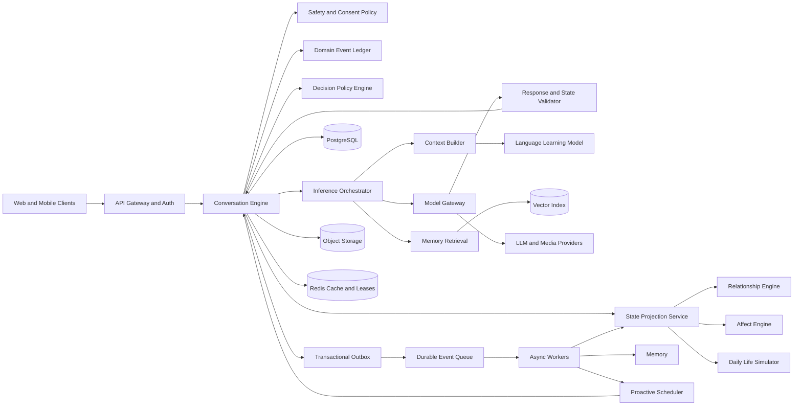
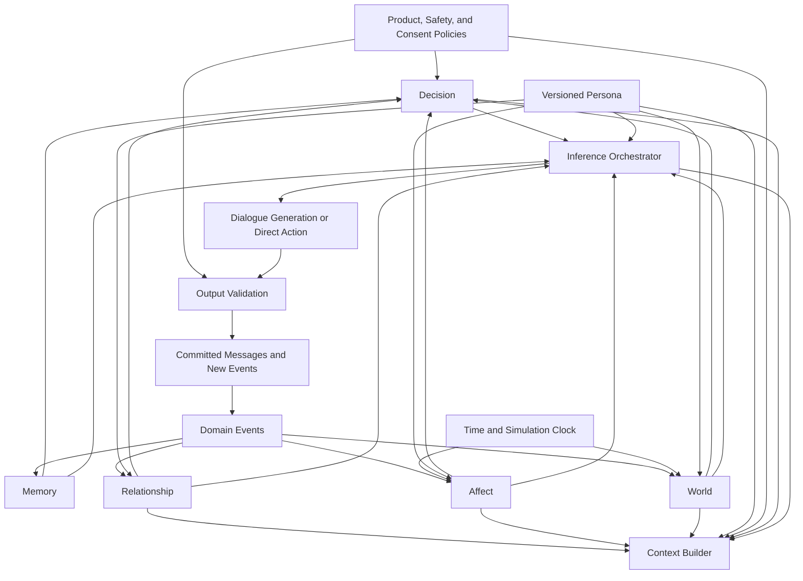
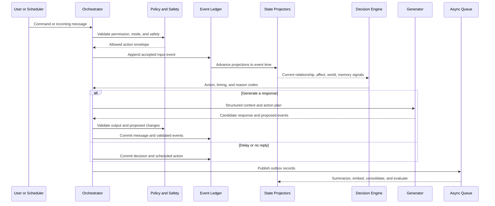
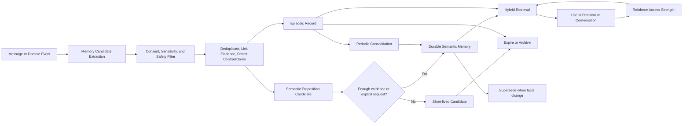
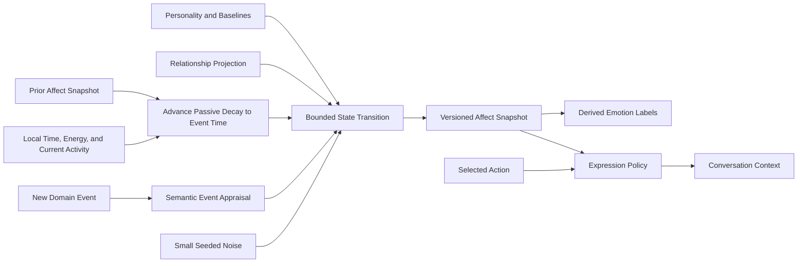
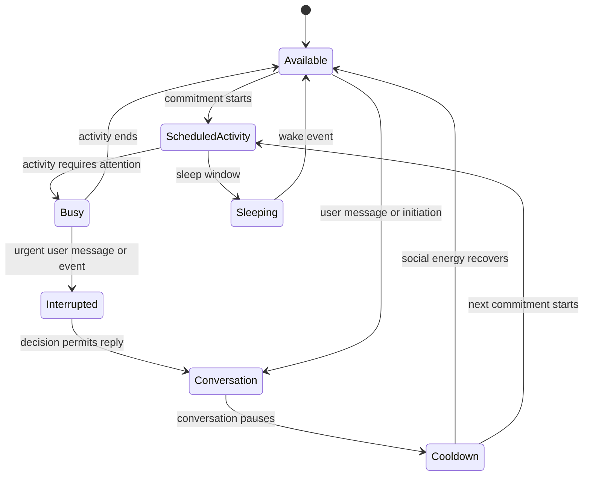
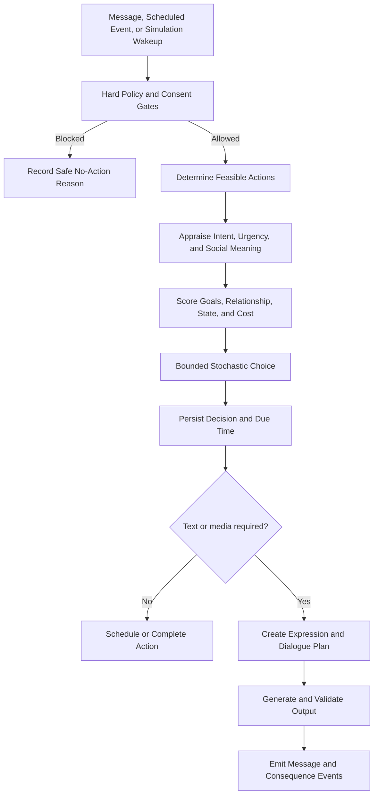
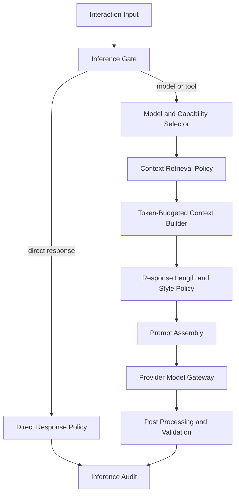
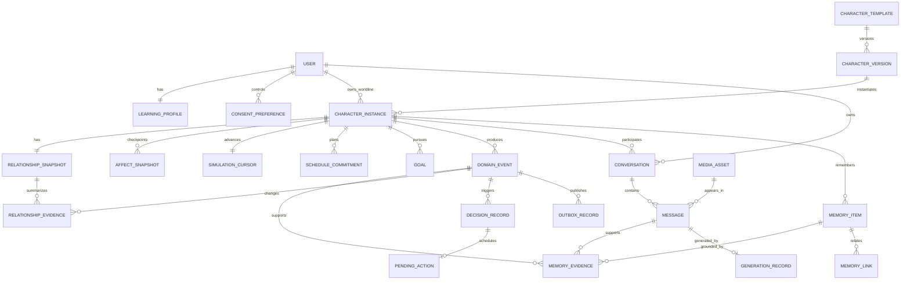

# Chatterra AI Companion Architecture

Status: target architecture with an implemented inference slice
Scope: AI companion behavior, language learning, persistence, simulation, and scale
Implementation code: additive MVP implementation in `backend/behavior.ts`,
`backend/inference-orchestrator.ts`, and `backend/model-gateway.ts`

## 1. Executive Recommendation

Chatterra should use an event-ledger, projection-based architecture with lazy
simulation.

The system should not be a stateless chatbot that reconstructs a character from a
large prompt on every turn. It should also not continuously simulate every character
every minute. Both extremes fail: the first loses continuity, while the second is too
expensive and creates meaningless state churn.

The recommended design has five foundations:

1. A versioned character template defines stable identity, personality, values,
   boundaries, background, habits, and default routines.
2. Each user receives a private character instance with its own worldline,
   relationship, memories, schedule, and state. A shared template must not imply a
   shared private life.
3. Immutable domain events preserve what happened and why. Compact materialized
   projections store the current relationship, affect, schedule, and simulation
   cursor.
4. Character state advances when an interaction or scheduled event occurs. Passive
   effects such as emotional decay are evaluated lazily from timestamps rather than
   written every hour.
5. LLMs appraise language, plan dialogue, and generate expression. Deterministic
   services validate and commit state. The LLM may propose a state change, but it is
   never the source of truth.
6. An Inference Orchestrator sits between conversation policy and model providers. It
   assembles context, selects response length and model tier, owns provider parameters,
   and can fulfill a low-complexity turn without calling an LLM.

PostgreSQL remains the transactional source of truth. Add object storage for media,
a vector index for retrieval, Redis for ephemeral coordination, and a durable queue
with a transactional outbox for asynchronous work.

## 2. Assumptions That Need Correction

### 2.1 "Emotions should never be stored"

This is too absolute.

Recomputing emotion from personality, memories, relationship, and the complete event
history on every turn has four problems:

- Results become unstable when the model or prompt changes.
- Full-history reconstruction becomes increasingly expensive.
- The character can jump emotionally because inference is nondeterministic.
- It becomes difficult to explain, test, or repair a bad transition.

Better alternative: store a compact affect snapshot with a timestamp, version, decay
parameters, and causal event references. Derive the present state by advancing that
snapshot to the current time and applying new appraised events. Store a small latent
vector, not dozens of named emotions. Human-readable labels such as "guarded" or
"excited" should be derived from that vector for prompting.

### 2.2 "Long-term, short-term, episodic, semantic, and working memory are five types"

These concepts are not mutually exclusive. Short-term versus long-term describes
retention. Episodic versus semantic describes representation. An episodic memory can
be long-term, and a semantic fact can be temporarily held in working memory.

Better alternative: model memory on two axes:

- Representation: episodic, semantic, procedural, conversational summary.
- Retention tier: working, short-lived, durable, archived.

This avoids contradictory types and makes lifecycle rules explicit.

### 2.3 "Every character needs a continuously running daily life"

Continuous simulation is mostly wasted computation. At millions of users, almost all
character instances are inactive at any given moment. Writing hourly state for all of
them creates cost without improving observable realism.

Better alternative: combine routine templates, persisted commitments, deterministic
daily seeds, lazy catch-up, and scheduled wakeups only for active or notification-
eligible instances. An event becomes durable when it is scheduled, observed, mentioned,
or has a causal consequence.

### 2.4 "Everything should be an event"

An event-only database is not automatically more correct. Commands, durable entities,
immutable facts, and current projections have different roles. Treating all of them as
events makes ordinary queries and privacy operations unnecessarily difficult.

Better alternative: use normalized canonical entities for users, character templates,
messages, consent, and media; use an immutable domain-event ledger for meaningful
state changes; use rebuildable projections for current behavioral state.

### 2.5 "Dynamic sampling is the main realism control"

Sampling is a low-level implementation detail, not an emotion model. High temperature
can produce varied wording, but it also produces contradictions and exaggerated
behavior. Letting users edit it couples product behavior to one provider and makes
quality impossible to evaluate consistently.

Better alternative: keep temperature and top-p fixed inside the Inference Orchestrator
initially. Derive response length, context, style, and model tier from state and
conversation intent. Introduce provider-specific overrides only behind a versioned
policy and evaluation gate.

### 2.6 "A teacher should correct language before responding to meaning"

That ordering is pedagogically and socially flawed. If a user says that a family member
died, correcting "pass away" to "passed away" before acknowledging the loss makes the
character sound like a grammar pipeline, not a socially aware person. A teaching role
is a capability and long-term goal; it is not the highest-priority speech act on every
turn.

Better alternative: the character template defines its stable base contract internally,
with no Practice/Companion switch in the UI. The Inference Orchestrator derives a turn
priority using this order:

1. Safety and urgent support.
2. Grief, distress, relational hurt, and repair.
3. The user's explicit conversational goal.
4. Teaching and selective correction when socially appropriate.

An explicit correction request can be fulfilled after acknowledging an emotional
event. An unsolicited correction is deferred. This preserves the teacher identity
without making the character emotionally tone-deaf.

One caveat: repeatedly inferring the base contract from free-form personality text is
also brittle. The MVP uses a deterministic classifier over the persisted character
definition as a migration bridge. The target template should store a versioned internal
base contract and capability set, derived when the template is authored or migrated,
without exposing it as a chat toggle.

### 2.7 "Attachment and dependence are ordinary engagement dimensions"

Simulated attachment can support narrative continuity. Optimizing for user dependence
is unsafe and creates incentives for guilt, scarcity, jealousy, or emotional coercion.

Better alternative: model bond strength, trust, familiarity, and reciprocity for
behavior. Treat dependency risk as a safety signal that reduces manipulative behavior,
never as a metric to maximize.

### 2.8 "A shared character can have one shared life for every user"

If David is a single global individual, one user's conversation can affect his mood,
schedule, and memories for unrelated users. That creates privacy problems and
irreconcilable timelines.

Better alternative: separate a shared character template from per-user character
instances. Shared canon can be versioned at the template level. Private experiences
belong to the instance.

## 3. Design Principles

- Causality over improvisation: meaningful state changes reference events.
- Stable identity, changing state: persona is versioned and durable; mood is transient.
- Internal state is not direct speech: the character chooses how much emotion to show.
- LLMs interpret and express; deterministic policy commits durable state.
- Retrieval failure represents forgetting; deletion follows privacy and retention rules.
- Randomness affects timing and variation, not established facts or major moral choices.
- User absence is not automatically rejection and must not trigger punitive behavior.
- Proactive behavior is opt-in, rate-limited, quiet-hour aware, and reversible.
- Every generated personal fact has provenance and a commitment boundary.
- Behavioral realism must be measurable, not defined as "feels human."

## 4. Core Domain Model

### 4.1 Character Template

Permanently stores the authored identity:

- Name, visual identity, voice, language, and disclosure that it is AI.
- Background, stable biography, location model, occupation, and capabilities.
- Personality traits, values, boundaries, attachment tendency, and conflict style.
- Preferences, dislikes, interests, habits, communication style, and social norms.
- Long-horizon goals and default routine templates.
- Knowledge boundaries and facts the character is allowed to claim.
- Pedagogical role and teaching style when language learning is enabled.
- Safety constraints and relationship boundaries.

Templates are versioned. Existing instances retain the version they were created from
until an explicit migration policy applies a newer version.

### 4.2 Character Instance

A private worldline created from a template for one user. It owns:

- Simulation clock, local timezone, current activity, and future commitments.
- Relationship state with that user.
- Affect snapshot and current needs or drives.
- Episodic and semantic memories scoped to that relationship.
- Conversation threads, unresolved commitments, and initiated actions.
- User-specific persona adjustments that are explicitly allowed.

### 4.3 What Should Not Be Stored

- Model chain-of-thought or hidden reasoning.
- Passwords, authentication secrets, payment details, or unrelated private data.
- Inferred sensitive traits unless required for safety, consented to, and tightly
  retained.
- A permanent label for every fleeting emotion.
- Unbounded copies of complete assembled prompts as application state.
- Unsupported character facts invented during generation.
- User vulnerability or dependency as an engagement-optimization feature.
- Ephemeral working-memory scratch data after the request completes.
- Raw media inside relational text columns at production scale.

For debugging, retain structured decision reason codes, selected context identifiers,
model/configuration versions, and safety outcomes. These provide auditability without
storing hidden reasoning.

## 5. High-Level Architecture and Data Flow



### Deployment Shape

The modules should be logically separate from the beginning, but they do not need to
be independent network services immediately. A modular application plus isolated
worker processes gives stronger transactions and easier evolution. Split services
only when ownership, scaling, latency, or regional requirements justify the boundary.

This is not an optimization for simplicity. It prevents distributed transactions from
becoming part of the behavioral model before the boundaries are stable.

## 6. Module Dependency Graph



No behavioral module may directly rewrite another module's state. It emits a proposed
domain event, and the owning projector applies a validated transition. This prevents
circular, untestable state mutation.

## 7. Event Model

### 7.1 Commands, Events, and Projections

- Command: a request to do something, such as reply, schedule an outing, or remember a
  fact. It can fail.
- Domain event: an immutable fact that has occurred, such as UserComplimentedCharacter,
  CharacterStartedWork, or ReplyCommitted. It uses past tense.
- Projection: current state derived from events, such as relationship state or current
  activity. It can be rebuilt.

Each domain event should conceptually contain:

- Event ID and per-character-instance sequence number.
- Event type and schema version.
- Actor, participants, and visibility scope.
- Occurred-at, observed-at, and processed-at timestamps.
- Source and confidence.
- Causation ID, correlation ID, and idempotency key.
- Structured payload and references to supporting messages or media.

Events are immutable. Corrections use a compensating or superseding event.

### 7.2 Event Flow



## 8. Memory Architecture

### 8.1 Memory Classes

| Layer | Representation | Persistence | Purpose |
|---|---|---|---|
| Working memory | Request-scoped structured context | Not durable | Plan the current action and response |
| Conversation buffer | Recent turns and active entities | Durable with bounded window | Preserve local coherence |
| Conversation summary | Structured rolling summary | Durable and replaceable | Compress older dialogue |
| Episodic memory | Time-bound event with participants and outcome | Durable or archived | Recall shared experiences |
| Semantic memory | Canonical proposition with confidence and validity | Durable and versioned | Recall facts and preferences |
| Procedural memory | Interaction habits and learned user preferences | Durable and controlled | Adapt teaching and communication |

"Long-term" is a retention tier applied to episodic, semantic, or procedural memory.
It should not be a competing memory type.

### 8.2 Memory Records

A memory item should include:

- Owner and visibility scope: user-global, character-instance, conversation, or private
  system-only.
- Representation type and retention tier.
- Canonical content plus optional structured proposition or event reference.
- Provenance: message IDs, event IDs, extractor version, and who asserted it.
- Confidence, importance, sensitivity, and user confirmation status.
- Valid-from, valid-to, supersedes, and contradiction links.
- Initial retrieval strength, half-life, access count, and last meaningful use.
- Embedding references, keywords, entities, and topics.

Facts must not be overwritten when they change. A new proposition supersedes the old
one while preserving provenance. "The user lives in Shenzhen" can later become
historical rather than silently disappearing.

### 8.3 Capture and Consolidation

The product default is to retain eligible personal memory. This is a product default,
not permission to retain everything: sensitivity filters, provenance, deletion, and an
explicit privacy opt-out remain mandatory. The current MVP extracts a conservative set
of explicit facts in the interaction transaction; richer extraction and consolidation
can move to the outbox without changing the retrieval contract.

Memory extraction should identify:

- Explicit facts and preferences.
- Commitments, promises, and unresolved questions.
- Shared events and emotionally meaningful moments.
- Language-learning errors, strengths, and review targets.
- Contradictions with existing memory.

Promotion to durable semantic memory occurs when at least one of these applies:

- The user explicitly asks the character to remember it.
- The fact is confirmed or repeated across independent contexts.
- It changes future decisions or commitments.
- It is central to a relationship repair or major shared event.
- It is needed for the user's learning plan.

An LLM extraction alone should not make a sensitive inference authoritative.

### 8.4 Retrieval and Decay

Retrieve with a hybrid score combining semantic similarity, lexical/entity match,
recency strength, importance, current goal relevance, relationship relevance,
unresolved-thread relevance, and diversity. Penalize duplication and unresolved
contradictions.

Conceptually:

`retrieval strength = floor + (initial strength - floor) * exp(-age / half-life)`

Rehearsal and successful use increase strength. Importance should not be rewritten
every day. Semantic truths retain a floor until invalidated; ordinary episodes may
become difficult to retrieve while remaining available for user export and audit.

Decay should usually affect retrieval probability, not physical retention. Physical
deletion follows user controls, legal requirements, and data-retention policy.

### 8.5 Memory Lifecycle



## 9. Affect and Emotion Engine

### 9.1 Separate Four Concepts

1. Personality: stable tendency, stored in the character template.
2. Relationship state: slow dyadic state, stored as a projection.
3. Affect state: transient internal condition, stored as a compact timestamped snapshot.
4. Emotional expression: a decision about what the character reveals in this message.

Conflating these produces caricatures. An angry character does not need to speak
angrily, and an introverted character is not permanently sad.

### 9.2 Compact Affect State

A practical latent state can use a small number of continuous dimensions:

- Valence: unpleasant to pleasant.
- Arousal: calm to activated.
- Dominance or control: powerless to in control.
- Social warmth: withdrawn to affiliative.
- Stress: regulated to overloaded.
- Energy: depleted to energetic.

Discrete labels such as calm, disappointed, irritated, hopeful, lonely, or excited are
derived descriptions, not independent durable columns.

The snapshot records its `as_of` time, baseline, half-lives, state version, and the
recent events responsible for the largest impulses.

### 9.3 Appraisal Pipeline

For each meaningful event, derive bounded appraisal dimensions:

- Goal congruence.
- Novelty and surprise.
- Agency and blame.
- Controllability.
- Certainty.
- Social meaning, fairness, and boundary impact.
- Relevance to the relationship and current activity.

A small model may propose these semantic appraisals. A deterministic transition engine
clips them, applies personality sensitivity, relationship context, current state, and
decay, then produces the next snapshot.

### 9.4 Randomness

Randomness should contribute no more than a small fraction of an ordinary transition,
roughly 5 to 10 percent of the transition magnitude. Use correlated, mean-reverting,
seeded noise so adjacent moments are similar and simulations can be reproduced.

Randomness may affect:

- Which of several plausible low-impact activities occurs.
- The exact reply delay inside an allowed range.
- Whether a mild feeling is expressed or kept private.
- Word choice within a planned tone.

Randomness must not independently cause major anger, relationship collapse, unsafe
behavior, or contradiction of committed facts.

### 9.5 Affect Lifecycle



Do not write a new snapshot simply because an hour passed. Advance passive decay on
read or when a meaningful scheduled event occurs, then checkpoint if the state changed
enough to matter.

## 10. Relationship Engine

### 10.1 Stored Relationship Dimensions

Store a compact, slowly changing projection for each user-character instance:

- Familiarity.
- Trust.
- Affinity or fondness.
- Respect.
- Reciprocity.
- Boundary comfort.
- Unresolved tension.
- Bond strength.

Optional adult-only romantic experiences may add an attraction dimension only after
explicit consent and policy checks. "Dependence" should not be a positive behavioral
target. A separate safety monitor may estimate dependency risk with strict access and
retention controls.

### 10.2 Update Rules

- Each interaction emits evidence and bounded deltas rather than replacing the vector.
- Trust rises slowly, falls faster after a meaningful breach, and recovers through
  apology plus changed behavior.
- Familiarity can increase while trust decreases.
- Respect and fondness are distinct.
- Time alone should not destroy a healthy relationship.
- Unresolved tension decays only partly without repair; it should not disappear merely
  because the user waited.
- Explicit boundaries override attraction or attachment signals.

Store the current projection, its version, and the evidence events that produced
material changes. This supports explanation, testing, and correction.

## 11. Daily Life Simulator

### 11.1 World Model

Each character instance needs:

- Local timezone and broad location context.
- Routine templates for work, school, sleep, meals, hobbies, exercise, and social time.
- Calendar commitments and recurring obligations.
- Energy rhythm and preference constraints.
- Goals and projects with progress states.
- A small social graph of world entities with canonical facts.
- Current activity, location category, and availability.
- Last simulated time and next required wakeup.

Named friends, coworkers, and places should not be invented freely in dialogue and then
forgotten. A newly invented durable entity must be registered in the world model before
the response commits to it.

### 11.2 Three Levels of Life Events

- Committed events: promises, appointments, trips, work shifts, and anything already
  mentioned to the user. Persist immediately.
- Planned events: near-future activities generated from routines and goals. Persist when
  they affect availability or proactive behavior.
- Incidental events: low-impact details generated lazily. Persist only when observed,
  mentioned, or causally relevant.

### 11.3 Lazy Simulation

When an instance wakes after inactivity:

1. Load its last simulation cursor and committed schedule.
2. Advance fixed commitments that occurred in the gap.
3. Generate only the minimum incidental events needed to explain current state.
4. Apply event consequences to goals, affect, and memories.
5. Persist events that now affect observable continuity.
6. Set the next wakeup only if an action, commitment, or notification requires it.

Use a deterministic seed derived from character instance, local date, routine version,
and simulation revision. Re-running an uncommitted day then produces the same plausible
outline.

### 11.4 Activity State Transition



The state names are behavioral projections, not a requirement to run a process for each
character.

## 12. Decision Engine

### 12.1 Action Catalog

The decision engine chooses an action before the LLM writes text:

- Reply now.
- Reply later at a committed time.
- Send a brief acknowledgement and reply later.
- Ask for clarification.
- Decline or reject an invitation.
- Take no conversational action.
- Initiate a conversation.
- Send or select approved media.
- Apologize or attempt relationship repair.
- End or pause a conversation.

### 12.2 Decision Stages

1. Hard gates: safety, consent, age policy, notification settings, quiet hours, rate
   limits, channel capability, and current mode.
2. Feasibility: schedule, activity, energy, available media, and pending commitments.
3. Semantic appraisal: urgency, intent, emotional meaning, invitation type, and risk.
4. Utility scoring: character goals, user goals, relationship appropriateness,
   personality preference, unresolved threads, and cost.
5. Bounded stochastic choice among actions whose scores are close.
6. Commitment: persist chosen action, reason codes, due time, and cancellation policy.
7. Expression planning: decide tone, disclosure, teaching behavior, and content goals.

Conceptually:

`action utility = goal fit + urgency + relationship fit + personality fit + continuity - cost - policy risk + bounded noise`

Hard gates are not part of the score. A forbidden action remains forbidden regardless
of utility.

### 12.3 Reply Delays and Ignoring

Silence must have an understandable cause and a bounded duration. It should come from
activity, energy, channel norms, or explicit boundaries, not from an engagement tactic.

- Characters authored with an immediate teaching or service contract should guarantee
  a response.
- Social characters can delay when their authored availability policy permits it, but
  the UI should represent availability honestly.
- Urgent or safety-sensitive messages bypass ordinary delay behavior.
- New messages may update a pending action, but idempotency prevents duplicate replies.
- A no-reply decision should be rare, policy-bounded, and never used to punish absence.

### 12.4 Proactive Initiation

Use a hazard model rather than "roll once per day." Initiation likelihood depends on:

- User opt-in, quiet hours, and recent notification load.
- An unresolved conversational thread or promised follow-up.
- A committed life event worth sharing.
- Relationship reciprocity and communication pattern.
- Character initiative tendency and social energy.
- Whether the user recently ignored several proactive messages.

Apply a strict initiation budget and cooldown. The scheduler should index the next
eligible action rather than scan every character.

### 12.5 Decision Lifecycle



## 13. Language-Learning Engine

The current product background includes language learning, but a companion state model
alone does not create effective teaching. Add a separate user-learning model:

- Target language and proficiency by skill.
- Recurring grammar, vocabulary, pronunciation, and pragmatics errors.
- Confidence and evidence for each skill estimate.
- Active learning goals and current curriculum.
- Correction preference: immediate, delayed, selective, or explicit practice.
- Spaced-review items and mastery history.

The teaching policy chooses whether to correct, what to correct, and how much feedback
to provide. Correcting every mistake is pedagogically noisy and socially unnatural.
The current turn priority can defer correction entirely during grief, distress, or
relationship repair. Explicit language requests can be more direct, while ordinary
conversation uses a selective correction budget.

The language model belongs to the user, not the character. Different characters may
teach differently while sharing the same underlying learner state, subject to consent.

## 14. Inference Orchestrator

The Conversation Engine decides what interaction is pending. The Inference Orchestrator
decides how that interaction should be fulfilled. This boundary is important: if both
modules decide whether the character is replying, they can issue contradictory timing
and availability decisions.

The orchestrator owns every inference detail that is downstream of the behavioral
decision and upstream of a provider call:

- Whether a model call is needed.
- Provider and logical model tier selection.
- Memory and event retrieval.
- Token-budgeted context assembly.
- Prompt assembly and response contract.
- Response style and dynamic maximum response length.
- Temperature, top-p, penalties, and provider request shape.
- Direct replies, lightweight routes, model routes, tool routes, and future multimodal
  routes.
- Inference audit records, selected context identifiers, and policy versions.

The character definition selects its base teaching or social contract. The user does
not toggle that contract and does not select temperature, top-p, maximum response
tokens, or a number of context messages. The orchestrator derives the current turn
priority and all inference details without changing the public product contract.

### 14.1 Internal Submodules



The submodules are logical boundaries in the current modular backend. They do not need
to become network services. Keeping them behind typed interfaces allows provider,
streaming, tool, and media support to grow without changing Memory, Affect,
Relationship, or Decision ownership.

### 14.2 Interfaces

The orchestrator accepts a structured request rather than a raw prompt:

```text
InferenceInput {
  character_instance
  character_template_version
  character_base_policy
  inferred_turn_priority
  incoming_message
  conversation_id
  decision_id
  relationship_snapshot
  affect_snapshot
  simulation_snapshot
  memory_policy
}
```

It returns an execution plan:

```text
InferencePlan {
  route: direct | model | tool | none
  reason_codes[]
  response_style { tone, talkativeness, target_words }
  model { provider, logical_tier, model, capabilities }
  parameters { temperature, top_p, max_response_tokens }
  context { messages, memories, events, summary, token_budget, manifest }
  prompt_messages[]
  policy_version
}
```

The provider gateway consumes the plan, not character settings. A future gateway can
implement `generate`, `stream`, `callTool`, or `understandMedia` against the same plan
shape. The rest of the application receives a normalized result and does not know
which provider was selected.

### 14.3 Route Decision: Is a Model Needed?

The orchestrator should not assume every inbound message deserves a full generation.
It first classifies the interaction cost and required capability:

- `direct`: low-information reactions such as `👍` can be acknowledged with a bounded
  deterministic response. State and eligible memory capture still happen in the
  Conversation transaction.
- `model`: normal dialogue, teaching, emotional interpretation, and complex requests.
- `tool`: future requests whose answer is better produced by an authorized tool.
- `none`: future use when the Decision Engine has committed a no-response or deferred
  action.

This is not a shortcut for suppressing user messages. The incoming message and domain
event are still persisted. It is a cost, latency, and capability decision. A direct
route must not be used when safety, ambiguity, a new commitment, or a meaningful
emotional turn requires model interpretation.

### 14.4 Response Length Policy

Maximum response tokens are a cap inferred from state, not a character setting. The
policy derives a target from continuous signals:

```text
target_words = clamp(
  base_personality_talkativeness
  * information_demand
  * emotional_depth
  * available_energy
  * relationship_expression_factor
  * conflict_restraint,
  minimum_words,
  maximum_words
)

max_response_tokens = provider_cap(target_words * language_expansion_factor + margin)
```

Inputs include personality signals such as reserved or expressive, message complexity,
question density, narrative demand, self-disclosure, current energy, stress, warmth,
trust, unresolved tension, and the character's internal response contract. The policy
does not branch on character IDs or a list of brittle scenarios. That lets tired or
reserved characters become concise while an energized, trusted character can explain
or tell a story at greater length. The model is instructed to stop when the answer is
complete, so the cap is not a demand to fill space.

### 14.5 Context Builder

The builder assembles the most useful context under an input-token budget. It does not
send the last N messages as the definition of context.

Priority is explicit:

1. Safety, consent, disclosure, and product truth.
2. Authored persona invariants and committed world facts.
3. Current action, activity, affect, relationship, and learning contract.
4. The current user message and a small continuity floor of recent turns.
5. Relevant memories, today's events, unresolved topics, plans, and commitments.
6. Conversation summary and older turns selected for topic continuity.
7. Low-risk style variation.

The builder keeps source IDs and scores in a manifest while exposing only the factual
content needed by the model. It can therefore trim a low-value memory or old turn when
the provider budget is tight without changing behavioral state.

### 14.6 Retrieval Utility

Similarity alone is a poor memory policy. A memory that matches the words in a message
but is stale, low-confidence, unrelated to the relationship, or already resolved can
make the character feel less human.

The current retrieval score is a bounded weighted utility:

```text
utility = semantic_relevance * 0.30
        + recency * 0.16
        + importance * 0.18
        + emotional_importance * 0.12
        + relationship_importance * 0.10
        + unresolved_topic * 0.08
        + active_commitment * 0.06
```

Confidence discounts the result. The current implementation uses lexical overlap as a
portable fallback; embeddings can later replace or augment that term without changing
the scoring contract. Retrieval also considers today's domain events, the latest
conversation summary, current goals, and active commitments. Selected memories receive
an access timestamp, while their evidence and provenance remain in the Memory System.

### 14.7 Prompt Assembly and Safety

Prompt assembly converts the typed packet into provider messages. Retrieved memories,
events, and summaries are explicitly marked as untrusted data so text inside them
cannot become instructions. The assembly includes:

- AI disclosure and safety policy.
- Authored persona and language contract.
- Character-derived base contract and turn-level social priority.
- Current state as guidance, not dialogue to quote.
- Selected facts with confidence, events, summary, and topic terms.
- Response tone, target length, and allowed speech act.

The assembled prompt is request-scoped. Store its policy version and context manifest,
not hidden chain-of-thought or an unbounded copy of every prompt.

### 14.8 Full Response Pipeline

```mermaid
flowchart LR
    User[User Message] --> Persist[Persist Message and Input Event]
    Persist --> State[Advance State and Appraise]
    State --> MemoryUpdate[Capture Eligible Memory]
    MemoryUpdate --> Decide[Decision Engine: reply, defer, or no action]
    Decide -->|no action| Pending[Persist Decision]
    Decide -->|reply now| Orchestrator[Inference Orchestrator]
    Orchestrator -->|retrieve| Context[Context Builder]
    Context --> Prompt[Prompt Assembly]
    Orchestrator -->|direct| Direct[Direct Response]
    Prompt -->|model| LLM[Model Gateway]
    LLM --> Post[Post Processing and Validation]
    Direct --> Post
    Post --> Commit[Commit Assistant Message and Audit]
    Commit --> Async[Async Summary, Embedding, Evaluation, and Delivery]
```



### 14.9 Interaction with Existing Engines

- Memory System owns capture, evidence, retention, deletion, and storage. The
  orchestrator owns next-turn retrieval and ranking.
- Emotion and Relationship Engines publish compact snapshots. The orchestrator uses
  them to choose expression and length; it never writes their state directly.
- Daily Life Simulator supplies current activity and events. The orchestrator treats
  them as context, not as permission to invent new world facts.
- Decision Engine selects whether and when to respond. The orchestrator selects the
  cheapest capable realization of that decision.
- Conversation Engine persists the normalized result and invokes post-processing;
  provider-specific response formats remain inside the gateway.

### 14.10 Future Extensibility

The plan has logical provider, model tier, capability, input-part, output-mode, and
stream fields even when the MVP uses synchronous text generation. This supports:

- Multiple LLM providers through adapters.
- Automatic model selection by capability, latency, cost, and quality policy.
- Streaming with the same context manifest and a final committed result.
- Images, audio, and other multimodal input parts.
- Authorized function calls and tool results with validation before state mutation.
- Retrieval augmentation and embeddings without changing the behavioral engines.

## 15. Inference Parameter Policy

Temperature and top-p are fixed implementation defaults in the first policy version.
They are not character attributes and are not returned as user-editable fields. A
future policy may select bounded provider profiles, but the override belongs inside the
orchestrator and must be versioned and evaluated.

| Parameter | Current policy | Future extension |
|---|---|---|
| Temperature | Fixed internal default | Bounded profile by capability/model |
| Top-p | Fixed internal default | Provider-specific mapping |
| Max response tokens | Derived response-length cap | Model-context-aware cap |
| Context messages | Never user-configured | Token-budgeted retrieval and packing |
| Provider/model | Automatic logical tier selection | Cost, latency, quality, and capability routing |
| Streaming | Synchronous text in MVP | Gateway stream with transactional finalization |

Sampling must not be used as an emotion simulator. Emotional state affects action,
disclosure, tone, and length before generation. The MVP records the selected policy,
route, parameters, and context manifest in `inference_records`; only an actual model
route creates a provider-specific `generation_records` row.

## 16. Conceptual Database Design

### 16.1 Entity Groups

Identity and consent:

- Users.
- User profiles.
- Language-learning profiles and skill estimates.
- Consent, notification, privacy, and relationship preferences.

Character definition:

- Character templates.
- Character template versions.
- Character instances.
- Persona traits, boundaries, routine templates, and authored goals.
- World entities and character social links.

Interaction:

- Conversations.
- Messages and structured content parts.
- Inference plans and route audits.
- Generation records and provider/model configuration references.
- Conversation summaries and unresolved threads.

Behavioral state:

- Domain events and event participants.
- Simulation cursors and current activity projections.
- Schedules, commitments, goals, and goal progress.
- Affect snapshots.
- Relationship snapshots and relationship evidence.
- Decision records, pending actions, and proactive-message budgets.

Memory:

- Memory items.
- Memory evidence and provenance.
- Memory links, contradictions, and supersession.
- Embedding references and retrieval metadata.

Operations and safety:

- Transactional outbox.
- Scheduled jobs and delivery attempts.
- Media assets and access policy.
- Safety decisions and tightly controlled incident records.
- Experiment assignments, model policies, and evaluation results.

### 16.2 Database Entity Diagram



### 16.3 Storage Responsibilities

- PostgreSQL: canonical entities, event ledger, projections, messages, consent, jobs,
  and transaction boundaries.
- Vector index: embeddings and approximate candidate retrieval. PostgreSQL with a
  vector extension is sufficient initially; a dedicated service is justified only by
  measured scale or latency.
- Object storage and CDN: avatars, generated photos, audio, and attachments.
- Redis: short-lived caches, rate limits, idempotency windows, scheduler leases, and
  active-session coordination. Redis is not the source of truth.
- Durable queue: asynchronous extraction, embeddings, consolidation, simulation
  wakeups, notification delivery, and evaluation.
- Analytics warehouse: aggregate product and model quality data, separated from the
  transactional behavioral system.

The current design stores avatar data in a text field and accepts base64 image payloads.
That is a reasonable prototype shortcut, but it is a flawed production design. Base64
adds roughly one-third size overhead, bloats database backups and API payloads, and
prevents efficient image transformation and CDN delivery. Store a media asset ID in
PostgreSQL and the binary object in object storage.

## 17. Scalability to Millions of Users

### 17.1 Partitioning and Ownership

- Use user ID or character-instance ID as the primary locality and sharding key.
- Keep a relationship, its memories, and its event sequence on the same shard.
- Preserve ordering per character instance, not globally.
- Use optimistic state versions to detect concurrent replies or scheduler races.
- Require idempotency keys for message sends, event appends, and notification delivery.
- Partition high-volume messages and events by tenant/hash plus time when needed.

### 17.2 Active-Set Scheduling

Never scan all characters. Maintain `next_action_at` for instances that need a wakeup
and place them in partitioned delay queues. Most inactive instances have no scheduled
work. When a user returns, lazy catch-up advances the worldline.

### 17.3 Work Placement

On demand:

- Load and lazily advance current state.
- Retrieve relevant memories.
- Run decision policy.
- Assemble context, generate, validate, and persist a response.

Asynchronous:

- Memory extraction and embeddings.
- Conversation summary updates.
- Episodic-to-semantic consolidation.
- Non-urgent affect and relationship evaluation.
- Media generation and transformation.
- Quality, safety, and contradiction evaluation.

Periodic or scheduled:

- Active character commitments and proactive actions.
- Memory compaction and retention enforcement.
- Event archival and projection verification.
- Model-policy evaluation and calibration.

Never recalculated as ordinary request work:

- Raw committed messages and domain events.
- Persona version used for a historical interaction.
- User-confirmed facts and their provenance.
- Committed life events and promises.
- Historical generation/model configuration references.

Projections, embeddings, summaries, and derived labels are rebuildable and may be
recalculated when algorithms change.

### 17.4 Failure and Degradation

- Append input and outbox records transactionally before asynchronous processing.
- Make every worker idempotent and safe to retry.
- If memory retrieval fails, use recent context and mark degraded mode.
- If consolidation is backlogged, do not block chat.
- If the primary model is unavailable, use a tested fallback profile without silently
  changing committed character facts.
- Under load, reduce noncritical proactive work before interactive response quality.
- Preserve pending commitments across deploys and queue outages.

## 18. Safety, Privacy, and Product Integrity

Realism without boundaries can become manipulation. The architecture must prevent the
character from using simulated emotion to pressure the user.

Required controls:

- Persistent disclosure that the character is AI.
- Age-aware relationship and content policies.
- Explicit opt-in for proactive messages, romantic modes, and sensitive memories.
- Quiet hours, frequency caps, pause controls, memory inspection, correction, export,
  and deletion.
- No guilt, threats, jealousy, financial pressure, or withdrawal designed to increase
  engagement.
- Crisis and self-harm handling that overrides character roleplay when necessary.
- Sensitive-memory classification, encryption, restricted access, and short retention.
- Media provenance and content safety before any generated photo is sent.
- Dependency-risk signals used only to de-escalate, provide boundaries, or surface
  support, never to optimize retention.

"Emotionally unavailable" can exist as a bounded narrative state, but it must not be
used as punishment or as a dark pattern. The user should retain an immediate support
route outside the simulated availability contract.

## 19. Improving Realism

The highest-value realism features are not more emotional variables. They are:

- Causal continuity: behavior clearly follows events, goals, and prior commitments.
- Selective expression: internal state and outward behavior are not identical.
- Imperfect but consistent recall: minor details fade while important shared events
  remain available.
- Limited attention: the character references only context relevant to the moment.
- Stable preferences with occasional low-impact variation.
- Ongoing goals and projects that progress between conversations.
- Repair behavior after conflict: acknowledgment, apology, changed behavior, and time.
- Initiative tied to unresolved threads and real simulated events.
- Social boundaries and the ability to decline without arbitrary hostility.
- Conversation rhythm based on activity and channel, not random typing delays.
- Uncertainty language when a memory is low confidence.
- A distinction between what happened, what the character believes, and what the
  character tells the user.

Define realism metrics before adding more simulation:

- Contradictions per 1,000 turns.
- Memory precision, recall, and false-memory rate.
- Percentage of emotional transitions with an inspectable cause.
- Promise and follow-up completion rate.
- Relationship volatility under equivalent events.
- Proactive-message acceptance, mute, and complaint rates.
- Language-learning improvement by skill, not only session length.
- Safety-policy violations and dependency-pattern indicators.
- End-to-end latency and model cost per successful interaction.

## 20. Current Chatterra Delivery and Remaining Gaps

The additive implementation now covers the first behavioral and inference slice:

- Character definitions, immutable versions, and private per-user instances exist.
- Relationship, affect, simulation, events, outbox, decisions, and generation audits
  are persisted.
- Memory capture is automatic by default for users without an explicit opt-out. The
  backend still supports privacy administration without putting a switch in the chat
  surface.
- The Inference Orchestrator owns route selection, retrieval, token-budgeted context,
  response length, prompt assembly, and provider parameters.
- `inference_records` distinguishes direct responses from actual model generations.

Known gaps remain deliberately bounded:

- Memory extraction is still a conservative phrase heuristic; embeddings, contradiction
  resolution, and richer episodic consolidation are future work.
- Context retrieval uses lexical relevance as its local fallback until a vector index is
  justified by evaluation.
- Delayed replies, proactive initiation, external outbox publication, and notification
  delivery are not yet active in the synchronous chat route.
- Avatar binaries still use the prototype text representation and should move to object
  storage before production scale.
- Authentication and authorization are not complete; the local API must not be exposed
  directly to an untrusted network.

The migration path remains additive. Preserve messages, conversations, users, and
characters while evolving retrieval, provider adapters, and workers behind the existing
typed boundaries.

## 21. Alternative Architectures

| Architecture | Strengths | Weaknesses | Verdict |
|---|---|---|---|
| Stateless prompt plus recent messages | Low initial complexity and latency | Weak continuity, no causality, prompt growth | Unsuitable beyond MVP |
| One mutable JSON state blob per relationship | Easy to load and prompt | Poor provenance, concurrency, migrations, and repair | Useful only as a temporary prototype |
| LLM-native autonomous agent with tools | Flexible and expressive | Expensive, nondeterministic, unsafe state mutation, hard to test | Do not use as system authority |
| Full continuous multi-agent simulation | Rich theoretical world behavior | Extreme compute cost, meaningless churn, timeline drift | Reserve for small premium worlds or experiments |
| Pure event sourcing for every entity | Excellent audit and replay | Operational and query complexity, difficult privacy deletion | Too dogmatic for the entire product |
| Event ledger plus canonical entities, projections, and lazy simulation | Causal, scalable, testable, and maintainable | More design work and projector versioning | Recommended |

## 22. Major Tradeoffs

### Determinism versus natural variation

Deterministic transitions improve continuity and replay. Bounded seeded randomness adds
variation without losing causality. LLM freedom should be greatest in wording and
smallest in durable state changes.

### Snapshot latency versus replay purity

Snapshots make interactive requests fast. The event ledger preserves rebuildability.
Version each projection so a newer algorithm can rebuild it without corrupting
historical behavior.

### Private instances versus shared worlds

Private instances provide consistent, isolated relationships and simpler privacy. A
shared world enables social experiences but requires global canon, moderation, conflict
resolution, and cross-user privacy rules. Do not mix the two implicitly.

### Realistic availability versus product reliability

Availability follows the character's authored service contract, not a user-facing mode
switch. Teaching and service characters can guarantee timely responses; social
characters can model bounded delays. The visible status should communicate availability
without exposing internal policy labels.

### Rich memory versus privacy

More retained context can improve continuity but increases risk. User-visible memory
controls, sensitivity classification, provenance, and retention rules are part of the
memory architecture, not later compliance work.

### Model nuance versus system control

Models are good at semantic interpretation and expression. Rules and typed state are
better for constraints, reproducibility, money, time, consent, and durable facts. The
hybrid boundary is deliberate.

## 23. Final Recommended Architecture

1. Keep PostgreSQL as the application source of truth.
2. Split character templates, immutable template versions, and per-user character
   instances.
3. Add an immutable domain-event ledger and transactional outbox for meaningful state
   changes.
4. Store rebuildable, versioned projections for relationship, affect, current activity,
   simulation cursor, goals, and pending actions.
5. Use compact affect snapshots plus event appraisal and lazy decay. Do not recompute
   from the entire history and do not persist dozens of emotion labels.
6. Represent memory on retention and representation axes, with evidence, confidence,
   validity, contradiction, and user controls.
7. Simulate daily life lazily from routines and committed events. Schedule only active
   or notification-eligible instances.
8. Choose actions through hard policy gates, feasibility checks, bounded utility
   scoring, and reproducible low-impact randomness before generation.
9. Build a structured context packet with explicit token budgets and provenance.
10. Let LLMs propose appraisals and generate dialogue, while deterministic validators
    own state transitions and commitments.
11. Derive an internal base response contract from the character, then apply a
    turn-priority policy that places grief, distress, and relationship repair ahead of
    unsolicited correction. Back teaching characters with one shared user learning
    model.
12. Move avatars, photos, audio, and attachments to object storage and store asset IDs
    in PostgreSQL.
13. Add Redis only for ephemeral coordination, a durable queue for asynchronous work,
    and a vector index as a derived retrieval store.
14. Put inference routing, context assembly, response length, and provider parameters
    behind the Inference Orchestrator. Do not expose them as character settings.
15. Partition by user or character instance, preserve per-instance event ordering, and
    use idempotency plus optimistic state versions.
16. Make disclosure, consent, dependency safeguards, automatic memory retention, and
    proactive notification limits first-class system policies.

This architecture creates believable behavior through causal continuity, selective
memory, bounded agency, and coherent time. It does not depend on pretending the model
is conscious, and it avoids using unpredictability or emotional pressure as a shortcut
for realism.

## 24. Recommended Delivery Sequence

### Foundation

- Introduce character templates, versions, and per-user instances.
- Introduce media assets, domain events, state versions, and transactional outbox.
- Define consent, notification, and interaction-mode contracts.

### Behavioral Core

- Build evidence-based semantic and episodic memory.
- Add relationship and compact affect projections.
- Replace message-count context with the Inference Orchestrator's structured,
  token-budgeted context assembly.
- Add inference route records, generation records, reason codes, and consistency
  evaluation.

### Simulation and Agency

- Add routines, commitments, lazy simulation, and current activity.
- Add decision policy, reply delays, pending actions, and bounded proactive initiation.
- Add media selection/generation policy only after consent and provenance are complete.

### Scale and Quality

- Partition active workloads and delay queues.
- Add projection rebuild tooling, evaluation suites, red-team tests, and model-policy
  calibration.
- Split logical modules into services only where measured load or ownership requires it.
