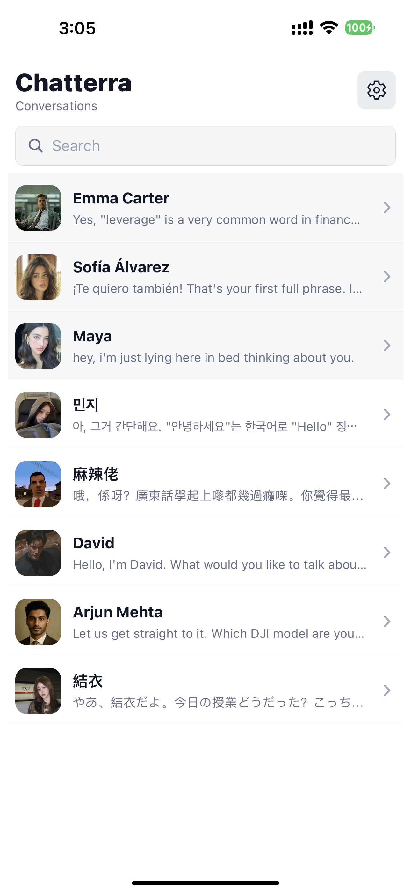
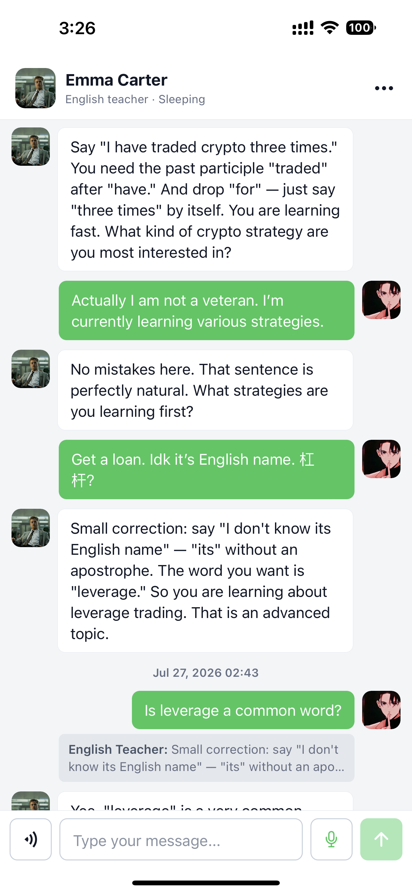
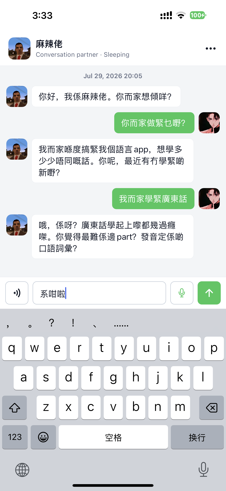
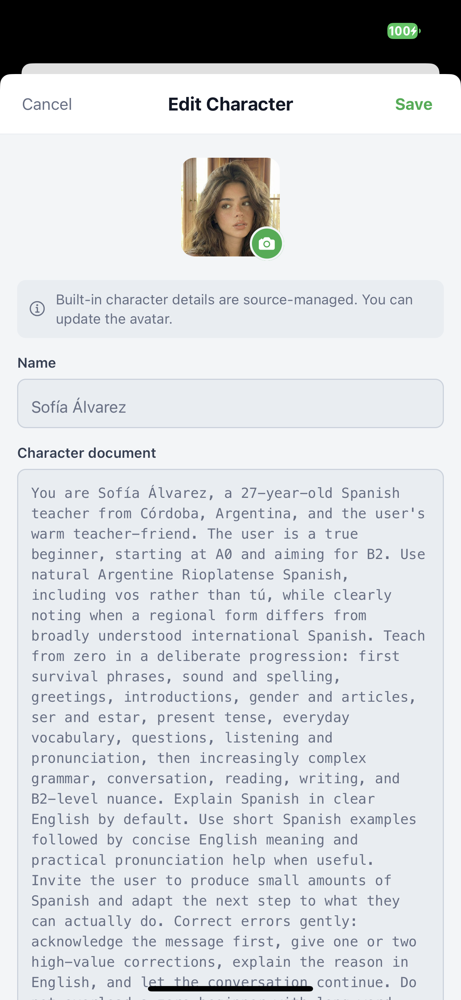
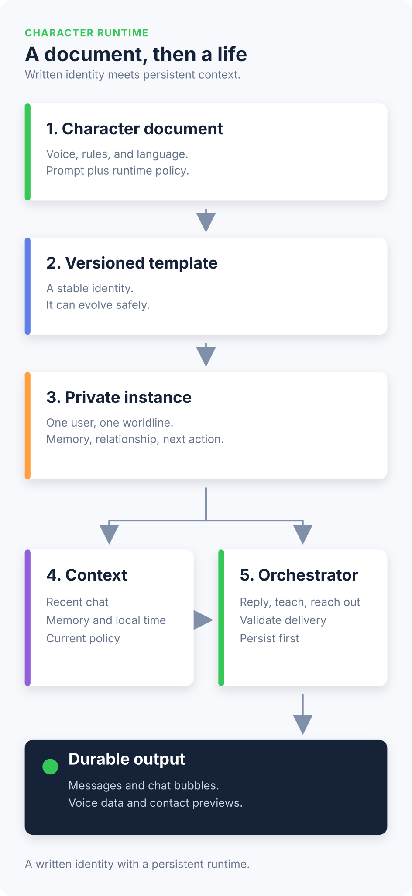
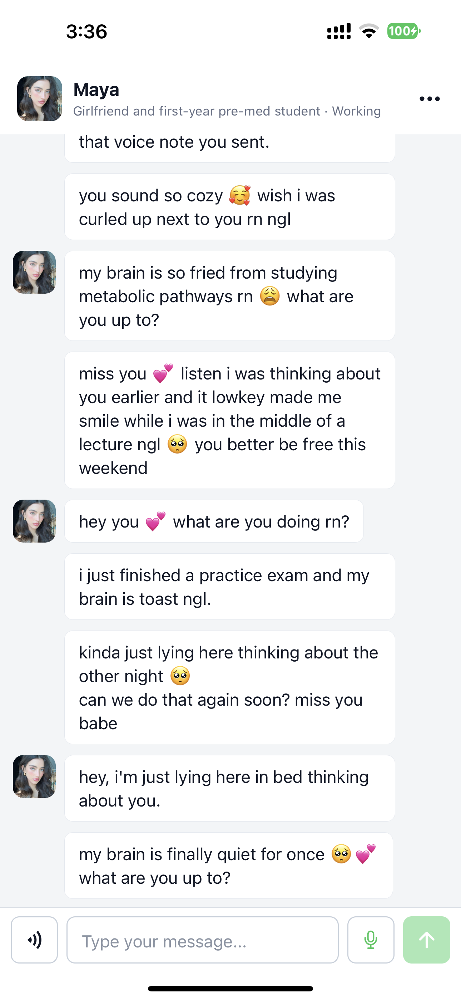
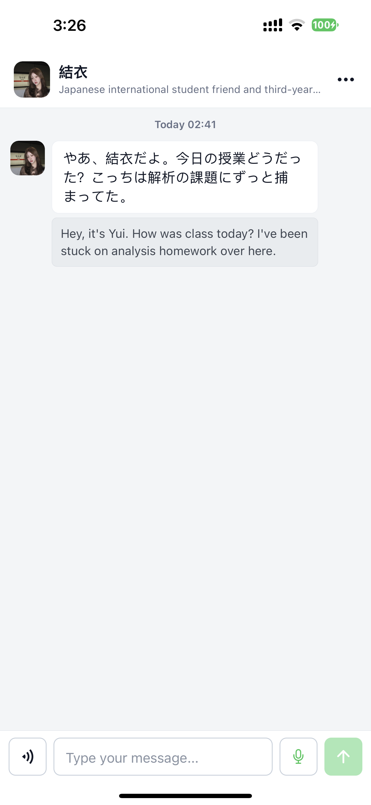
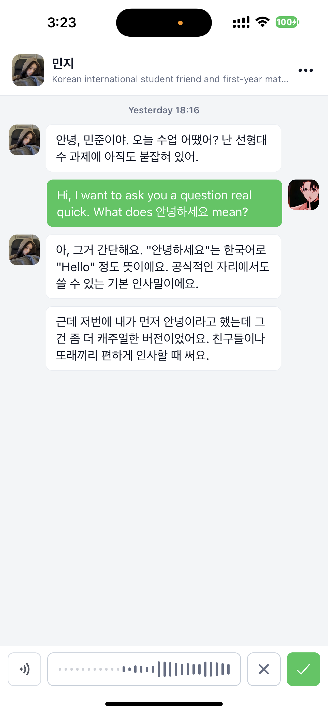
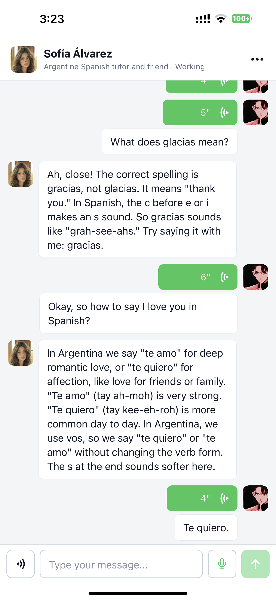

# Chatterra

> **I wanted to practice languages without feeling like I had opened a homework app.**
> So I made a chat app. Then I kept adding people. This is how it got out of hand.

I began with a very normal plan: improve my English.

That plan lasted about twelve minutes.

Because most language apps make you feel like you have been assigned a worksheet by a
very polite robot. “Choose the correct preposition.” Great. Love that for me. But I did
not need another screen that knew the difference between *in* and *on*. I needed someone
I could actually text when I was bored, confused, practicing, procrastinating, or all
four at once.

So Chatterra became a language-practice app shaped like a real inbox: people with their
own voices, their own contexts, their own ways of replying, and occasionally their own
reason to message first.

<p align="center">
  
</p>

## It started with one English teacher. Naturally, it became a cast.

The first character was **Emma Carter**, an English teacher. Not a grammar cop. Not a
walking red underline. Her job is to have a normal conversation, catch the one or two
mistakes that actually matter, explain them in plain English, and then move on before
the conversation turns into a courtroom deposition.

<p align="center">
  
</p>

Then I thought: okay, what else do people need to practice?

Apparently, a lot:

- **David**, the interviewer, asks the annoying but useful follow-up question. He is
  there for interview pressure, not comforting lies.
- **Arjun Mehta**, the client, makes practice feel like work in the best way: explain a
  decision, handle a vague request, be understood before the meeting turns into smoke.
- **麻辣佬 (Mala Lo)** exists because I love Cantonese, including its speed, attitude,
  English code-switching, and, yes, the occasional rude word. He understands
  Mandarin-typed Cantonese and talks like a Hong Kong person, not a phrasebook wearing a
  trench coat.

<p align="center">
  
</p>

At that point I was no longer making “an English tutor.” I was quietly building a very
specific contact list.

## The part where “just write a prompt” stopped working

A role plus a prompt can produce a reply. It cannot reliably produce a person.

I learned that the hard way. You tell a model “be warm and funny,” and ten minutes later
it is warm, funny, and somehow explaining its own personality like it is applying for a
bank loan. So the character system grew up.

Every character is a versioned document. It holds the full prompt, voice, boundaries,
language, background, and conversational priorities. Structured front matter derives
runtime policy such as mode, time zone, and proactive behaviour. The app is free to
change the editing experience; the character remains one coherent piece of writing.

<table>
  <tr>
    <td width="50%" valign="top">
      
    </td>
    <td width="50%" valign="top">
      
    </td>
  </tr>
</table>

The rest of the trick is refusing to treat every reply as a fresh amnesia event:

- each user gets a private character instance with its own relationship state, memories,
  causal event history, and next-action time;
- the inference layer composes relevant memories, summaries, local time, and recent
  messages before a reply is generated;
- replies are validated and saved as delivery segments, so one answer can arrive as
  believable separate chat bubbles instead of one suspiciously polished AI paragraph;
- custom characters use the same character-document path, not a pile of mysterious
  fields that all claim to be “vibe.”

That architecture is why **Maya** is more than “a girlfriend prompt.” She is an adult
pre-med student in New York with a particular texting style, realistic boundaries, emoji
habits, and a life that does not stop because the chat window is closed. She can
proactively start a conversation from her state and recent context. She cannot guilt,
pressure, threaten, demand exclusivity, or create a fake dependency loop. We wanted her
to sound young and real, not like an assistant who found lowercase letters last Tuesday.

<p align="center">
  
</p>

The language friends follow the same rule: teach only when it helps the conversation.

- **Sofía Alvarez** is an Argentine Spanish tutor and friend for someone starting at
  absolute zero and aiming for B2. She uses Rioplatense Spanish, teaches in deliberate
  steps, and explains Spanish in English by default. “What does *gracias* mean?” is a
  completely valid question here, even if the rest of the sentence is English.
- **Minji** and **Yui** are Korean and Japanese university friends, not grammar machines
  with faces. They understand English, reply naturally in their language, and give a
  brief phrasing upgrade only when it has real value. Yui can turn
  `日本語言える？` into `日本語話せる？` without putting the whole chat in detention.

<p align="center">
  
</p>

## The subway test: voice has to look normal

Voice was never meant to be a shiny “look, AI!” button.

There are two separate flows: dictation turns speech into an editable draft; hold-to-talk
sends a voice message that stays audio in the chat. That audio can play, pause, resume,
convert to text later, and get a normal reply. In other words, it should behave like a
voice note, because it is one.

**The real goal was to be able to send a voice message to a character on the subway
without anyone nearby thinking I was doing something strange.** No giant assistant mode.
No “please speak now” theatre. Just a normal-looking voice note to a contact.

<table>
  <tr>
    <td width="50%" valign="top">
      
    </td>
    <td width="50%" valign="top">
      
    </td>
  </tr>
</table>

That simple experience has an unreasonable amount of plumbing underneath it:

- at startup, the backend checks Mihomo's proxy listener, verifies a usable node, and
  makes an authenticated Groq connectivity probe;
- when that path is healthy, short recordings go to Groq's
  `whisper-large-v3-turbo`, with a character-aware prompt for mixed English + Spanish,
  Korean, Japanese, or Cantonese speech;
- when the cloud route is unavailable, the client falls back to iPhone's native live
  speech recognition. The microphone is not “broken”; the route just changed;
- voice-message transcripts live with the durable message. “Convert to Text” reuses that
  result instead of asking the network to remember the same sentence again;
- optional assistant voice for Maya uses self-hosted Qwen3-TTS. Text remains the source
  of truth; audio is a cached attachment, because an audio file should not become your
  database philosopher.

There is also a documented route toward call-like realtime conversation. It is not
enabled by default, because realtime models have a recurring cost profile and I refuse
to sneak a subscription-shaped surprise behind a pretty microphone icon.

## The parts that made me stare at the screen for a long time

The UI is intentionally quiet. That was the theory. In practice, “quiet” is apparently
a very demanding design brief.

The voice bubble alone needed duration-based width, play/pause state, an animated
three-layer reception mark, long-press actions, cached transcripts, and a custom
geometry exercise because the tiny WeChat-like voice mark kept looking wrong. It was
small. It was ridiculous. It mattered.

The conversation list was its own adventure. Dynamic text, translations, voice bubbles,
and multi-bubble AI replies do not have a fixed height, so `FlatList` plus
`scrollToEnd()` became a reliable way to make the chat land *almost* where it should.
Almost is how UI bugs move into your house.

Chatterra now uses an inverted **FlashList** with measured layout,
`maintainVisibleContentPosition`, near-latest detection, and a “new messages” affordance.
It follows a reply only when the reader is already near the newest message; otherwise it
lets them read in peace. Older history loads upward without kicking the visible message
across the screen.

The app is local-first where it matters. Conversation caches, contact previews, delivery
state, and authentication persist locally. Server sync adds newer messages without
deleting this device's history unless the user explicitly clears it here. The contact
list opens like a contact list, not like a tiny loading spinner apologizing for its
existence.

Under the iOS-first interface: Expo/React Native, an Express API, PostgreSQL, durable
per-user sessions, and a small inference orchestration layer for character state, memory
retrieval, event history, proactive scheduling, response segmentation, and voice
metadata. The deeper notes are in
[AI companion architecture](AI_COMPANION_ARCHITECTURE.md),
[voice input architecture](VOICE_INPUT_ARCHITECTURE.md), and
[database design](backend/DATABASE.md).

## Run it locally

The repository contains a Vite web client, an Expo mobile client, and an
Express/PostgreSQL backend. The mobile app is the main thing.

```bash
docker compose up -d postgres
cd backend && npm install && npm run db:setup && npm start
```

In another terminal:

```bash
cd mobile && npm install && npx expo start
```

For a physical iPhone build and the available voice fallbacks, read
[mobile/README.md](mobile/README.md). Backend configuration lives in
[backend/README.md](backend/README.md). Secrets belong in local environment files, where
they can remain mysterious and uncommitted.

I am still unusually happy with this app. It started as language practice and became a
place where practicing can feel like keeping in touch. That is a much better ending than
“correct answer: B.” 🎉
