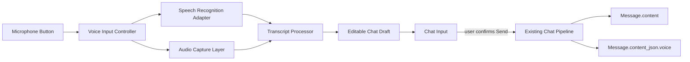

# Chatterra Voice Input Architecture

Status: browser dictation MVP implemented

## Boundary

Voice input is an input modality, not a second chat pipeline. The existing conversation
request remains the authority for sending a message:



`frontend/src/voice/` owns browser APIs, recognition events, audio lifetime,
interruption recovery, language labeling, and voice state. `InputBox` only renders the
state and copies transcript updates into its controlled draft. `ChatPage` passes the
final metadata through the existing `/api/chat` request.

## State Machine

```text
idle -> processing   permission and recognition startup
processing -> recording   recognition started
recording -> recording    partial transcript or recognition restart
recording -> processing   user presses the microphone to stop
processing -> idle        final transcript and audio collection complete
processing -> error       permission, device, or recognition failure
error -> processing       user retries the microphone
```

The Send button and Enter key are disabled while recording or finalizing. A transcript
is never sent automatically. The user can edit it after recognition and then use the
normal send action.

## Transcript Contract

The browser keeps the audio blob in memory for the current session. The chat request
stores only bounded metadata and the final text:

```json
{
  "content": "final text sent by the user",
  "content_json": {
    "voice": {
      "originalText": "raw recognition result",
      "correctedText": "optional user-edited draft",
      "detectedLanguage": "Mixed",
      "confidence": 0.95,
      "audioAvailable": true
    }
  }
}
```

`originalText` is never overwritten by manual editing. `correctedText` represents the
draft the user chose to send; it is not an AI correction. A future analysis service can
consume the in-memory audio blob, transcript, language, and confidence without changing
the message contract.

## Recognition and Language Policy

The MVP uses the browser Web Speech API with the selected character's language as the
recognition hint, `continuous = true`, and `interimResults = true`. For example,
Cantonese characters use the `zh-HK` BCP 47 hint instead of inheriting a `zh-CN`
browser locale. `navigator.language` is only a fallback when the character has no
language preference. The transcript processor emits both partial and final updates
and preserves text returned by the engine, including mixed scripts when the browser
recognizes them.

Web Speech does not offer reliable, provider-independent automatic language detection.
The UI therefore does not ask the user to choose a language, but the current detected
language label is a script-based signal. True language-independent detection belongs in
a server or realtime speech adapter and must be evaluated per provider.

## Audio Capture

`AudioCapture` requests microphone permission only after the user presses the button. It
records a session-scoped `MediaRecorder` blob when supported, stops all tracks after the
session, and does not upload or persist raw audio in the MVP. Permission denial,
missing devices, unsupported recording, and recognition failures have separate UI error
paths.

## Future Adapters

The browser adapter can be replaced or supplemented without changing `InputBox`:

- Streaming audio over WebSocket to a realtime speech-to-text provider.
- Server-side language identification and diarization.
- Pronunciation, accent, fluency, vocabulary, and grammar analysis.
- Audio emotion features, subject to explicit consent and retention policy.
- Voice conversation mode with interruptible assistant audio.

The future adapter should preserve the same session events: `started`, `partial`,
`final`, `interrupted`, `completed`, and `failed`. Provider-specific confidence and
language fields belong in the adapter result, not in the chat component.

## Privacy and Failure Rules

- A microphone permission prompt is initiated only by a user gesture.
- Raw audio is not sent to the current chat endpoint.
- Recognition failure never fabricates text.
- A partial transcript is visibly marked by the recording state and remains editable.
- A failed session can be retried without losing a manually typed draft.
- Any future audio upload needs its own consent, size limit, retention policy, and
  access control.
