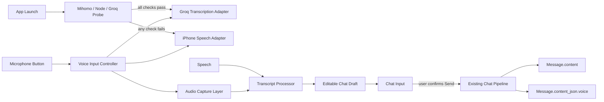

# Chatterra Voice Input Architecture

Status: cloud Groq transcription with native iPhone fallback implemented

## Boundary

Voice input is an input modality, not a second chat pipeline. The existing conversation
request remains the authority for sending a message:


```mermaid
flowchart LR
    Launch[App Launch] --> Probe[Mihomo / Node / Groq Probe]
    Probe -->|all checks pass| Cloud[Groq Transcription Adapter]
    Probe -->|any check fails| Local[iPhone Speech Adapter]
    Mic[Microphone Button] --> Controller[Voice Input Controller]
    Controller --> Capture[Audio Capture Layer]
    Controller --> Cloud
    Controller --> Local
    Speech --> Transcript[Transcript Processor]
    Capture --> Transcript
    Transcript --> Draft[Editable Chat Draft]
    Draft --> Input[Chat Input]
    Input -->|user confirms Send| Chat[Existing Chat Pipeline]
    Chat --> Message[Message.content]
    Chat --> Metadata[Message.content_json.voice]
```

At app startup, `GET /api/voice/capability` verifies the server's Mihomo listener,
selected/available route, and an authenticated Groq request in that order. The mobile
client defaults to the iPhone speech adapter while this runs and uses the cloud adapter
only after all three checks pass. `mobile/src/voice-input.ts` owns recording,
transcription events, audio lifetime, interruption recovery, language labeling, and
voice state. `InputBox` only renders the state and copies transcript updates into its
controlled draft. `ChatPage` passes the final metadata through the existing `/api/chat`
request.

## State Machine

```text
idle -> processing   permission and recognition startup
processing -> recording   recognition started
recording -> recording    partial transcript or recognition restart
recording -> processing   user presses the microphone to stop
processing -> idle        final transcript and audio collection complete
processing -> error       permission, device, or recognition failure
error -> processing       user retries the microphone
```

The Send button and Enter key are disabled while recording or finalizing. A transcript
is never sent automatically. The user can edit it after recognition and then use the
normal send action.

## Transcript Contract

The mobile client records an audio file in its cache for the current session. It asks for
separate consent before uploading that recording to the Chatterra transcription endpoint,
which forwards it to Groq without writing it to disk. The client deletes its cached file
after the request. The chat request stores only bounded metadata and the final text:

```json
{
  "content": "final text sent by the user",
  "content_json": {
    "voice": {
      "originalText": "raw recognition result",
      "correctedText": "optional user-edited draft",
      "detectedLanguage": "Mixed",
      "confidence": 0.95,
      "audioAvailable": true
    }
  }
}
```

`originalText` is never overwritten by manual editing. `correctedText` represents the
draft the user chose to send; it is not an AI correction. A future analysis service can
consume the in-memory audio blob, transcript, language, and confidence without changing
the message contract.

## Recognition and Language Policy

The cloud adapter uses Groq Whisper transcription without a forced language parameter,
so the provider can recognize the language mix in each short recording. When cloud
capability checks fail, the native adapter uses the character's language with a
supported-locale fallback on the iPhone. Both adapters emit an editable result and derive
a script-based language label for message metadata.

## Audio Capture

The cloud recorder requests microphone permission only after the user presses the button.
It limits recordings to 30 seconds. Raw audio is never attached to a chat message,
persisted by Chatterra, or written to the backend filesystem. The native fallback uses
the iPhone speech-recognition capability directly and does not upload an audio file.
Permission denial, network failures, provider failures, and no-speech results have
separate error paths.

## Future Adapters

The browser adapter can be replaced or supplemented without changing `InputBox`:

- Streaming audio over WebSocket to a realtime speech-to-text provider.
- Server-side language identification and diarization.
- Pronunciation, accent, fluency, vocabulary, and grammar analysis.
- Audio emotion features, subject to explicit consent and retention policy.
- Voice conversation mode with interruptible assistant audio.

The future adapter should preserve the same session events: `started`, `partial`,
`final`, `interrupted`, `completed`, and `failed`. Provider-specific confidence and
language fields belong in the adapter result, not in the chat component.

## Deferred Product Roadmap

These are product candidates, not active implementation work.

### Paid Realtime Calls

Consider full-duplex, interruptible live voice calls only after users demonstrate a
willingness to pay for the feature. A production version requires authenticated,
short-lived realtime sessions, explicit usage quotas, per-call cost telemetry, and
mobile call audio handling. It must not place a provider API key in the client.

### Assistant Voice Messages

Evaluate optional WeChat-style assistant voice bubbles before realtime calls. The
assistant text remains the canonical message; after it is persisted, a background TTS
job may create a short, cached audio clip that the user explicitly taps to play.

- Keep clips short and always retain the text fallback.
- Store audio outside `messages.content_json` and save only bounded media metadata,
  such as the object URL, duration, MIME type, voice identifier, and generation version.
- Bind each fictional character to a configured synthetic voice. Do not clone an
  identifiable person's voice without documented authorization and a separate review.
- Add a user preference for whether voice bubbles are enabled and a clear disclosure
  that the audio is AI-generated.

## Privacy and Failure Rules

- A microphone permission prompt is initiated only by a user gesture.
- Raw audio is not sent to the chat endpoint and is never stored by Chatterra. It is sent
  only to the dedicated transcription endpoint after the user accepts the disclosure.
- Recognition failure never fabricates text.
- A partial transcript is visibly marked by the recording state and remains editable.
- A failed session can be retried without losing a manually typed draft.
- Any future audio upload needs its own consent, size limit, retention policy, and
  access control.
