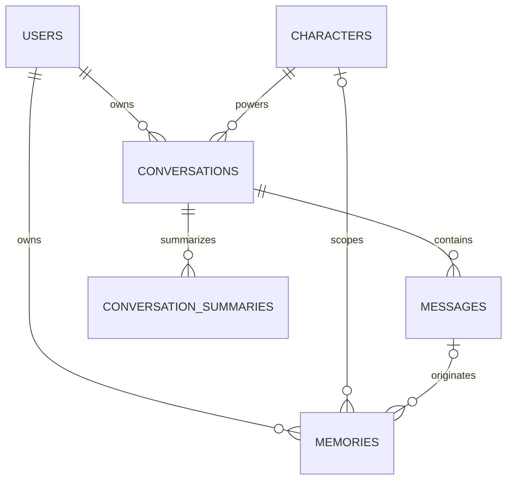

# PostgreSQL Design

Chatterra uses PostgreSQL as its application source of truth. The JSON files in
`/data` are retained only as legacy migration inputs.

## Relationships

## Tables

- `users`: user profile and flexible preference/consent JSONB documents.
- `characters`: editable persona fields and model settings.
- `conversations`: one user/character chat session.
- `messages`: ordered user, assistant, and system messages.
- `memories`: extracted facts scoped to a user and optionally a character/message.
- `conversation_summaries`: generated summaries and flexible coverage metadata.
- `schema_migrations`: applied SQL migration versions.

IDs use `TEXT` deliberately. Existing data contains legacy IDs such as `c1`,
`c2`, and timestamp-based user IDs, so converting primary keys to UUID would
break references during migration.

Foreign keys define lifecycle behavior:

- Deleting a user cascades through conversations, messages, summaries, and memories.
- Deleting a conversation cascades through messages and summaries.
- Characters referenced by conversations cannot be deleted.
- Deleted character/message references on memories become `NULL`.

JSONB is limited to fields whose shape can evolve independently: user goals and
preferences, character model settings, record metadata, structured message
content, and summary coverage.

## JSON Import

`npm run db:import-json` is idempotent and imports the current `/data/*.json`
files with insert-only conflict handling. Existing PostgreSQL rows always win, so
rerunning the importer cannot overwrite later application edits. It also:

- creates placeholder users when memories or conversations reference a missing user;
- creates placeholder characters for missing referenced character IDs;
- skips messages whose conversation no longer exists;
- sets deleted `originMessageId` references to `NULL`.
