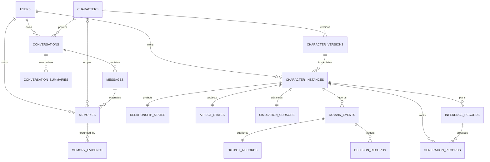

# PostgreSQL Design

Chatterra uses PostgreSQL as its application source of truth. The JSON files in
`/data` are retained only as legacy migration inputs.

The behavioral architecture is additive. Existing character, conversation, message,
and memory records remain compatible while per-user simulation state is stored in
separate versioned projections.

## Relationships



## Tables

- `users`: user profile and flexible preference/consent JSONB documents.
- `characters`: editable persona fields. Legacy model-setting JSON is retained only
  for migration compatibility and is not exposed or used for inference.
- `conversations`: one user/character chat session.
- `messages`: ordered user, assistant, and system messages.
- `memories`: extracted facts scoped to a user and optionally a character/message.
- `conversation_summaries`: generated summaries and flexible coverage metadata.
- `character_versions`: immutable snapshots of editable character templates.
- `character_instances`: one private user/character worldline and event sequence.
- `relationship_states`: rebuildable, slowly changing relationship projection.
- `affect_states`: compact, timestamped affect projection with passive decay.
- `simulation_cursors`: lazy daily-life cursor and current activity.
- `domain_events`: immutable causal event ledger ordered per character instance.
- `outbox_records`: reliable asynchronous publication boundary for each event.
- `memory_evidence`: message/event provenance for semantic memory records.
- `decision_records`: selected action, mode, reason codes, and due time.
- `inference_records`: route decision, policy version, response style, selected context,
  structured inference diagnostics, and completion status for every direct/model/tool
  inference path or intentional `none` route.
- `generation_records`: provider-specific model profile, parameters, selected context
  IDs, diagnostics, and latency for actual model calls.
- `user_learning_profiles`: user-owned correction policy and proficiency state.
- `schema_migrations`: applied SQL migration versions.

IDs use `TEXT` deliberately. Existing data contains legacy IDs such as `c1`,
`c2`, and timestamp-based user IDs, so converting primary keys to UUID would
break references during migration.

Foreign keys define lifecycle behavior:

- Deleting a user cascades through conversations, messages, summaries, and memories.
- Deleting a conversation cascades through messages and summaries.
- Characters referenced by conversations cannot be deleted.
- Deleted character/message references on memories become `NULL`.

JSONB is limited to fields whose shape can evolve independently: user goals and
preferences, record metadata, structured message content, inference manifests, and
summary coverage. Model sampling settings are policy-owned, not character data.

## Behavioral Request Flow

For every incoming message, the API:

1. Persists the message and ensures a private character instance exists.
2. Advances passive time and current activity from the simulation cursor.
3. Appends an ordered `user_message_received` event and outbox record.
4. Applies bounded relationship and affect transitions.
5. Extracts eligible deduplicated memory with evidence and provenance by default. An
   explicit backend privacy opt-out suppresses capture and retrieval.
6. Records an explainable `reply_now` or `no_reply` behavioral policy decision.
7. The Inference Orchestrator maps `no_reply` to a `none` route without retrieval or a
   provider call. Otherwise it decides whether a model is needed, retrieves context,
   builds a token-budgeted prompt, and derives response length and provider parameters.
8. Persists either a no-reply event and inference audit, or the assistant message,
   event, inference audit, and (for model routes) provider generation audit.

State reads checkpoint decay only after a meaningful interval or activity change.
They do not append domain events.

## Current Delivery Boundary

The current implementation includes the synchronous behavioral core and durable
outbox. External queue publication, delayed companion replies, proactive initiation,
media object storage, and embedding-based retrieval remain separate delivery slices.
They should build on the existing event and instance IDs rather than change the chat
contract again.

Durable personal memory defaults to enabled for new users and for legacy users whose
preference has never been set. The chat UI does not expose a memory switch. The
`memoryPersonalization` flag remains a backend privacy control for explicit opt-out,
and the behavioral extractor checks it transactionally before capture; the inference
orchestrator also suppresses retrieval when it is disabled.

Inference parameters are internal. `temperature`, `top_p`, `max_response_tokens`, and
context message selection are derived by `Inference Orchestrator`; they are not accepted
from character update payloads and are not returned by the character API.

Inference diagnostics are deliberately bounded and privacy-scoped. Each chat request
emits structured JSON log lines with a `traceId` and records stages such as plan
construction, provider response parsing, output validation, output rejection, and
persistence. It does not store the API key, full prompt, or raw provider response
envelope. Query a recent trace with:

Language policy is observe-only during post-processing. Non-empty normalized responses
are not rejected for a language mismatch. A `language_policy_observed` trace event stores
bounded script metrics and a likely cause when the configured language and response do
not match, including substantial English in a Cantonese or Mandarin context.

Accepted assistant output is stored in `messages`. Rejected assistant output is stored
separately in `inference_records.diagnostics.rejectedOutput`, bounded to 4,000
characters; prompts and retrieved context are never copied into that field.

```sql
SELECT created_at, provider, model, status, diagnostics
FROM inference_records
ORDER BY created_at DESC
LIMIT 20;
```

The `mode` columns on character instances, decisions, inferences, and generations are
internal policy labels derived from the character definition. The chat API ignores a
client-supplied mode, and public state does not expose one. Turn-level priorities such
as `emotional_support` are stored in the inference response-style audit.

Voice messages use the existing `messages.content_json` column. The `voice` object
stores bounded original/editable transcript metadata; raw audio is not persisted by the
current browser MVP.

## JSON Import

`npm run db:import-json` is idempotent and imports the current `/data/*.json`
files with insert-only conflict handling. Existing PostgreSQL rows always win, so
rerunning the importer cannot overwrite later application edits. It also:

- creates placeholder users when memories or conversations reference a missing user;
- creates placeholder characters for missing referenced character IDs;
- skips messages whose conversation no longer exists;
- sets deleted `originMessageId` references to `NULL`.
